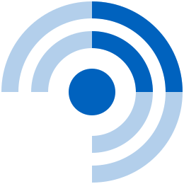

# FreshRSS

**FreshRSS** is a self-hosted RSS and Atom feed aggregator — your own private
news reader. Instead of algorithmic timelines deciding what you see, you
subscribe to the sites, blogs, YouTube channels and podcasts you actually care
about and read them in one clean, fast, chronological place. It fetches and
stores articles on your own server (so nothing is lost when a post is edited or
pulled), supports folders and tags, full-text search, sharing, and — crucially —
the **Google Reader / Fever APIs**, so dozens of mobile apps (Reeder, NetNewsWire,
FeedMe, …) can sync against it. For a homelab it's the tool that gives you back a
calm, self-owned way to follow the web.

  

 

## Official container image

- **Image:** `freshrss/freshrss`
- **Project:** https://github.com/FreshRSS/FreshRSS
- **Docs:** https://freshrss.github.io/FreshRSS/

## Deployment Notes

- **One container.** Single `freshrss` service (PHP, Alpine-based). Defaults to
  an embedded **SQLite** database, which is plenty for a personal reader; it can
  be pointed at MySQL/PostgreSQL for large multi-user setups.
- **Persistent state.** Two named volumes: `freshrss_data`
  (`/var/www/FreshRSS/data` — the database and your configuration) and
  `freshrss_extensions` (`/var/www/FreshRSS/extensions`). Back up `data`.
- **Single HTTP interface** on port `80` (mapped to `8083` here).
- **Built-in feed refresh.** `CRON_MIN` sets the schedule for the in-container
  cron that pulls new articles (default: every 20 minutes) — no external cron
  needed.
- **First run.** Finish the short web installer, create your admin user, then
  add feeds. Enable the Google Reader / Fever API under settings to connect
  mobile apps.
- **Healthcheck** fetches the root page with the image's busybox `wget`.
- **Resource limits** (`mem_limit` / `mem_reservation` / `cpus`) and all
  environment-specific values are externalized to `.env`.

## Example Use

- Follow blogs, news sites and newsletters in one chronological feed.
- Subscribe to YouTube channels and podcasts as feeds (no account needed).
- Sync with a mobile RSS app via the Google Reader / Fever API.
- Use full-text search and tags to turn feeds into a personal knowledge stream.

## Thanks

To the **FreshRSS** project and its contributors for a fast, private,
self-hostable way to read the web.

## Links

- Project: https://github.com/FreshRSS/FreshRSS
- Documentation: https://freshrss.github.io/FreshRSS/
- Docker guide: https://freshrss.github.io/FreshRSS/en/admins/09_Docker.html
