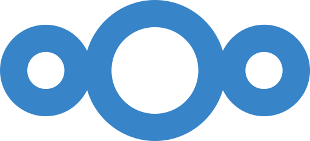

# Nextcloud

**Nextcloud** is a full self-hosted productivity suite — the open-source answer
to Google Drive / iCloud. At its core it's file sync and share (desktop and
mobile clients, web UI, shared links), but it's really a platform: calendars and
contacts (CalDAV/CardDAV), notes, tasks, photo galleries, collaborative office
documents, and a large app store to bolt on more. Everything lives on hardware
you control, so your files, calendar and contacts never sit on someone else's
cloud. For a homelab it's the flagship "own your data" app — the one that can
replace several commercial subscriptions at once.

  

 

## Official container image

- **Image:** `nextcloud` (Apache variant)
- **Project:** https://github.com/nextcloud/docker
- **Docs:** https://docs.nextcloud.com/

## Deployment Notes

- **Four containers:**
  - `nextcloud` — the app (Apache + PHP), the single HTTP interface on port `80`.
  - `cron` — the **same image** run as `/cron.sh`; executes Nextcloud's
    background jobs every 5 minutes (the recommended mode over AJAX/webcron).
  - `db` — **PostgreSQL 16** (Nextcloud's preferred database).
  - `redis` — caching and transactional **file locking** (prevents sync
    conflicts); password-protected via `--requirepass`.
- **Startup order.** Both `nextcloud` and `cron` wait for `db` and `redis` to be
  `service_healthy` before starting.
- **Persistent state.** Named volumes: `nextcloud_app` (`/var/www/html` — app
  code, `config/`, and by default the user **data** directory) and `db_data`
  (PostgreSQL). For easier backups you can split the data dir onto its own
  volume later; back up `db` with `pg_dump` plus the data directory.
- **Trusted domains.** `NEXTCLOUD_TRUSTED_DOMAINS` must list every hostname/IP
  you'll reach it by, or Nextcloud shows an "untrusted domain" error.
- **First run.** The admin account is created once from
  `NEXTCLOUD_ADMIN_USER` / `NEXTCLOUD_ADMIN_PASSWORD`; the initial install can
  take a minute (hence the long healthcheck `start_period`).
- **Healthchecks.** App uses a PHP one-liner against `status.php` (the image
  ships PHP, not necessarily `curl`); `db` uses `pg_isready`; `redis` uses
  `redis-cli ping` with the password.
- **Reverse proxy.** Behind a proxy (e.g. Nginx Proxy Manager) set
  `OVERWRITEPROTOCOL`, `OVERWRITECLIURL` and `TRUSTED_PROXIES` so links and
  redirects are generated correctly (lines provided, commented).
- **Resource limits** (`mem_limit` / `mem_reservation` / `cpus`) and all
  environment-specific values are externalized to `.env`.

## Example Use

- Sync files across laptop, phone and server with the official clients.
- Replace Google Calendar / Contacts with CalDAV/CardDAV you own.
- Auto-upload your phone's photos to your own storage.
- Share files/folders with expiring, password-protected links.
- Add apps from the store — Notes, Tasks, Deck, collaborative office docs.

## Thanks

To the **Nextcloud** project and its maintainers for a complete, genuinely
self-hostable cloud.

## Links

- Project: https://github.com/nextcloud/docker
- Documentation: https://docs.nextcloud.com/
- Admin manual: https://docs.nextcloud.com/server/stable/admin_manual/
