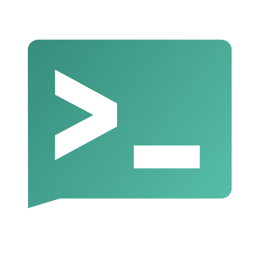

This directory contains an example deployment of ntfy, a self-hosted push
notification service. ntfy lets you send notifications to your phone (or desktop,
or browser) with a simple HTTP request — no accounts, no cloud middleman. You
publish a message to a "topic" (just a URL), and any device subscribed to that
topic gets an instant push notification. It's perfect for a homelab: have your
backup script, cron jobs, monitoring, or any server task ping you when something
finishes — or breaks — right on your phone, all through your own server.


<p align="center">
  
</p>

<br>


## Official container image

https://github.com/binwiederhier/ntfy — image published as `binwiederhier/ntfy`.

## Deployment Notes

- Runs as a single container (the `serve` command starts the server).
- Stores its message cache (a small SQLite DB) in the `ntfy_cache` volume and any
  config / user database in `ntfy_config`.
- Exposes an HTTP interface on container port `80` (published on host `8090` here);
  this same port serves the web UI, the publish/subscribe API and the apps.
- `NTFY_BASE_URL` must be set to the address you actually reach it on — the phone
  apps and links depend on it.
- Includes a healthcheck against ntfy's `/v1/health` endpoint.
- Open by default (anyone who can reach it can publish/subscribe) — fine on a
  private network; enable auth (`NTFY_AUTH_FILE` + access control) if it's exposed.
- Memory and CPU limits are minimal.
- **Backups:** only the volumes matter, and only if you enable auth/persistent
  users — the message cache is transient by design.

## Example Use

ntfy can be used to:

- get a phone push when a backup script finishes or fails
- alert on cron jobs, deploys, long-running tasks completing
- forward monitoring/alerting events to your phone
- send yourself quick notes/links from any script or `curl` one-liner
- subscribe from the iOS/Android apps, a browser, or the desktop

Send a notification with nothing more than:

```bash
curl -d "Backup finished ✅" http://<your-ntfy>/backups
```

Anyone subscribed to the `backups` topic gets it instantly.

## Thanks

Thanks to Philipp Heckel (binwiederhier) and the ntfy project for a dead-simple,
open-source push-notification service that's a joy to wire into a homelab.

## Links

- Source: https://github.com/binwiederhier/ntfy
- Website / docs: https://docs.ntfy.sh
